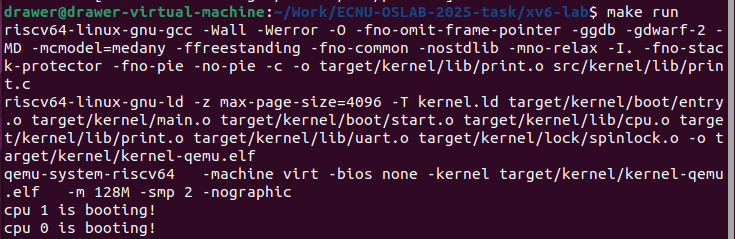
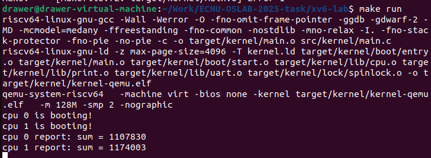
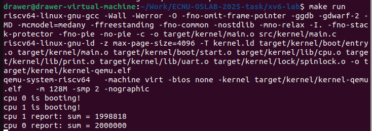
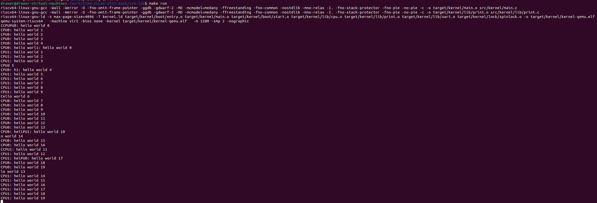

---

# LAB-1: 机器启动

## 1. 实验目标

* 理解并实现 **RISC-V 双核机器启动**流程：从 `entry.S` → `start.c` → `main.c`。
* 实现一个最简版的 **printf**，通过 UART 串口输出启动信息。
* 解决 **多核并行执行**导致的资源竞争问题（printf 输出错乱、数据更新丢失），掌握自旋锁的作用。

---

## 2. 代码组织结构

```
ECNU-OSLAB-2025-TASK  
├── LICENSE  
├── .vscode  
├── registers.xml  
├── Makefile  
├── common.mk  
├── kernel.ld  
├── pictures              # 实验截图存放目录
├── README.md             # 实验报告  
└── src
    └── kernel
        ├── arch          # RISC-V 架构相关
        │   ├── method.h  
        │   ├── mod.h  
        │   └── type.h  
        ├── boot          # 启动流程
        │   ├── entry.S  
        │   └── start.c   
        ├── lock          # 自旋锁
        │   ├── spinlock.c  
        │   ├── method.h  
        │   ├── mod.h  
        │   └── type.h  
        ├── lib           # 常用库
        │   ├── cpu.c  
        │   ├── print.c   
        │   ├── uart.c  
        │   ├── method.h  
        │   ├── mod.h  
        │   └── type.h  
        └── main.c        # 内核入口
```

---

## 3. 实验核心任务

### 3.1 机器启动流程

* **目标**：在 QEMU 上实现双核启动，每个核能进入 `main.c`，并输出启动信息。
* **启动流程**：

  ```
  QEMU PC=0x80000000 → entry.S → start.c → main.c
  ```
* **关键点**：

  * `entry.S` 为每个 hart 分配独立栈并跳到 `start()`。
  * `start.c` 在 M 模式下设置 `mepc=main`，配置 `mstatus.MPP=S`，执行 `mret` 切换到 S 模式。
  * `main.c` 调用 `printf` 打印 “cpu X is booting!”。

**关键代码**：

```c
// 设置M-mode的返回地址
w_mepc((uint64)main);

// 触发状态迁移，回到上一个状态（M-mode->S-mode）
asm volatile("mret");
```

**实验截图**


---

### 3.2 printf 的资源竞争问题

* **问题**：多个 CPU 同时调用 `printf`，底层调用 `uart_putc_sync` 输出字符，可能交叉产生混乱输出。
* **解决方法**：在 `printf` 内部使用 **自旋锁**，保证 UART 输出在同一时刻只能被一个 CPU 占用。

**关键代码**：

```c
// 自旋锁初始化
void spinlock_init(spinlock_t *lk, char *name)
{
    lk->locked = 0;
    lk->name = name;
    lk->cpuid = -1;  // 使用 -1 表示未持有，避免与 0 号 CPU 冲突
}

// 是否持有自旋锁
bool spinlock_holding(spinlock_t *lk)
{
    return lk->locked && lk->cpuid == mycpuid();
}

// 获取自旋锁
void spinlock_acquire(spinlock_t *lk)
{
    push_off(); // 关中断
    
    if (spinlock_holding(lk)) {
        panic("spinlock_acquire: already holding\n");
    }
    
    while (__sync_lock_test_and_set(&lk->locked, 1) != 0) {
        // 自旋等待
    }
    
    __sync_synchronize();
    lk->cpuid = mycpuid();
}

// 释放自旋锁
void spinlock_release(spinlock_t *lk)
{
    if (!spinlock_holding(lk)) {
        panic("spinlock_release: not holding\n");
    }
    
    lk->cpuid = -1;
    __sync_lock_release(&lk->locked);
    pop_off(); // 开中断
}
```

---

## 4. 课后实验

### 4.1 并行加法

* **实验思路**：

  * 两个 CPU 各自执行 `1000000` 次 `sum++`。
  * 不加锁时，`sum++` 不是原子操作，导致结果 < 2000000。
  * 加锁后保证正确性，结果接近 2000000。

---

**锁的粒度说明**

1. **细粒度锁**（每次 `sum++` 前后都加锁/解锁）

```c
for (int i = 0; i < 1000000; i++) {
    spinlock_acquire(&sum_lk);
    sum++;
    spinlock_release(&sum_lk);
}
```

* **效果**：结果正确，两个 CPU 可以交替更新 `sum`，不会丢失。
* **优点**：保证公平性，CPU 都能频繁获得机会操作共享资源。
* **缺点**：锁操作次数非常多（200 万次加锁/解锁），性能开销大。

---

2. **粗粒度锁**（整个循环只加一次锁）

```c
spinlock_acquire(&sum_lk);
for (int i = 0; i < 1000000; i++) {
    sum++;
}
spinlock_release(&sum_lk);
```

* **效果**：结果同样正确。
* **优点**：加解锁次数少（只有 2 次），性能好。
* **缺点**：一个 CPU 会独占锁很久（执行 100 万次加法期间），另一个 CPU 要长时间等待，几乎丧失了并行性。

---

**实验截图**



---

### 4.2 并行输出

* **实验思路**：

  * 去掉 `printf` 内部的锁，让两个 CPU 频繁打印字符串。
  * 输出会交错，产生错乱。

**测试代码**：

```c
#include "arch/mod.h"
#include "lib/mod.h"

volatile static int started = 0;

int main()
{
    int cpuid = r_tp();

    if (cpuid == 0) {
        print_init();
        started = 1;

        for (int i = 0; i < 20; i++) {
            printf("CPU%d: hello world %d\n", cpuid, i);
        }
    } else {
        while (started == 0) ;
        for (int i = 0; i < 20; i++) {
            printf("CPU%d: hello world %d\n", cpuid, i);
        }
    }

    while (1);
}
```

* **结论**

  * 去掉锁时，多个 CPU 输出交错，字符错乱。
  * 加锁后，输出总是有序的。

**实验截图**


---

## 5. 实验总结

* 熟悉了 RISC-V 双核启动的基本流程（entry.S → start.c → main.c）。
* 实现了最小可用的 `printf`，并理解了 **串口资源竞争**问题。
* 掌握了 **自旋锁**的作用：

  * 保证并行环境下共享资源的互斥访问；
  * 锁的粒度不同会带来性能与公平性的权衡。
* 通过 4.1 并行加法 和 4.2 并行输出，直观体会了“数据竞争”和“资源竞争”的危害。

---


