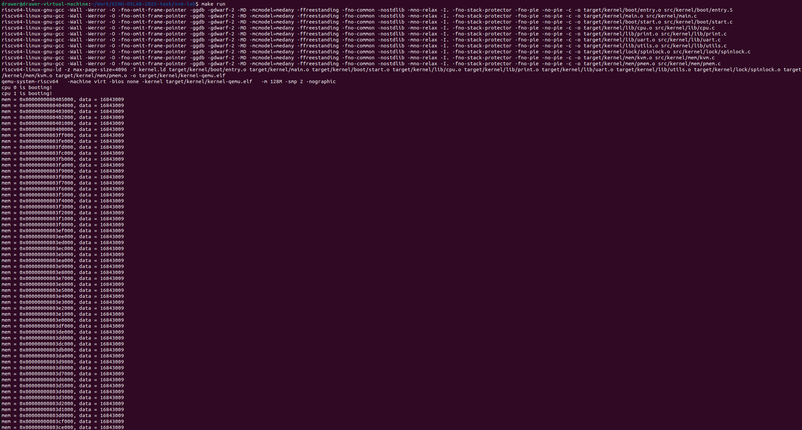
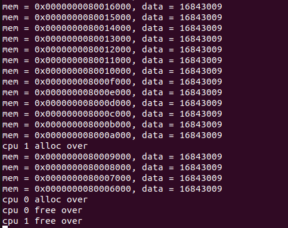
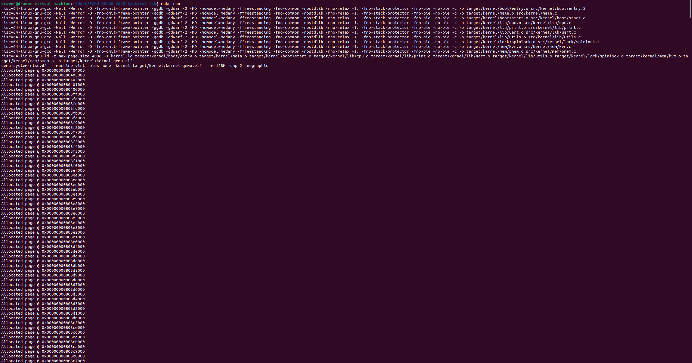
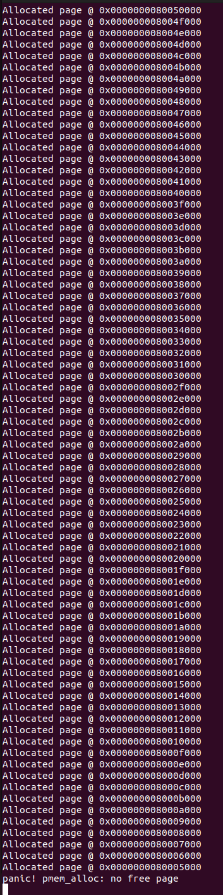
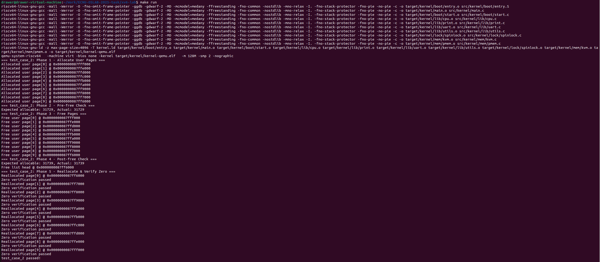
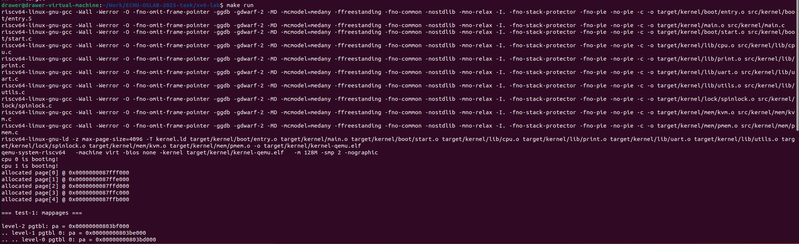
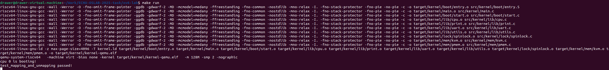

---

```markdown
# LAB-2: 内存管理初步

## 1. 实验目标

* 实现基于 **空闲页链表** 的物理内存分配与回收。  
* 构建 **SV39 内核页表**，支持虚拟内存映射和解映射操作。  
* 掌握 **panic/assert** 在内核中的调试与防御性编程作用。  

---

## 2. 代码组织结构

```

ECNU-OSLAB-2025-TASK
├── LICENSE
├── .vscode
├── registers.xml
├── Makefile
├── common.mk
├── kernel.ld
├── pictures              # 实验截图存放目录
├── README.md             # 实验报告
└── src
└── kernel
├── arch          # RISC-V 架构相关
│   ├── method.h
│   ├── mod.h
│   └── type.h
├── boot          # 启动流程
│   ├── entry.S
│   └── start.c
├── lock          # 自旋锁
│   ├── spinlock.c
│   ├── method.h
│   ├── mod.h
│   └── type.h
├── lib           # 常用库
│   ├── cpu.c
│   ├── print.c
│   ├── uart.c
│   ├── utils.c
│   ├── method.h
│   ├── mod.h
│   └── type.h
├── mem           # ⭐ 内存管理模块
│   ├── pmem.c    # 物理内存管理
│   ├── kvm.c     # 内核虚拟内存管理
│   ├── method.h
│   ├── mod.h
│   └── type.h
├── trap          # 中断模块（预留）
│   ├── method.h
│   ├── mod.h
│   └── type.h
└── main.c        # 内核入口

````

---

## 3. 实验核心任务

### 3.1 物理内存管理

* **目标**：  
  - 将 `ALLOC_BEGIN ~ ALLOC_END` 划分为 4KB 页。  
  - 使用 **链表** 管理空闲页。  
  - 内核区与用户区分开管理。  

* **关键函数**：
  - `pmem_init()`：初始化物理内存分配区。  
  - `pmem_alloc()`：申请一个物理页。  
  - `pmem_free()`：释放一个物理页。  

**关键代码**：

```c
/* 初始化物理内存 */
void pmem_init(void) {
    uint64 base   = (uint64)ALLOC_BEGIN;
    uint64 end    = (uint64)ALLOC_END;
    uint64 split  = base + (uint64)KERN_PAGES * PGSIZE;

    region_build(&kern_region, base, split,  "kern_region");
    region_build(&user_region, split, end,   "user_region");
}

/* 分配一个物理页 */
void* pmem_alloc(bool in_kernel) {
    alloc_region_t *r = in_kernel ? &kern_region : &user_region;

    spinlock_acquire(&r->lk);

    page_node_t *node = r->list_head.next;
    if (node == 0) {
        spinlock_release(&r->lk);
        panic("pmem_alloc: no free page");
    }

    r->list_head.next = node->next;
    r->allocable--;

    spinlock_release(&r->lk);

    // 清零页内容
    memset((void*)node, 0, PGSIZE);
    return (void*)node;
}

/* 释放一个物理页 */
void pmem_free(uint64 page, bool in_kernel) {
    if (!is_page_aligned(page)) {
        panic("pmem_free: not aligned");
    }

    alloc_region_t *r = in_kernel ? &kern_region : &user_region;

    if (page < r->begin || page >= r->end) {
        panic("pmem_free: out of range");
    }

    page_node_t *node = (page_node_t*)page;

    spinlock_acquire(&r->lk);
    node->next = r->list_head.next;
    r->list_head.next = node;
    r->allocable++;
    spinlock_release(&r->lk);
}
````

**实验截图**



---

### 3.2 物理内存测试用例

* **test_case_1**：持续分配物理页，测试耗尽内存后是否触发 `panic`。
* **test_case_2**：

  * 分配用户页并写入数据；
  * 验证分配数量是否正确；
  * 释放并检查空闲页数是否恢复；
  * 再次分配，确认页面已被清零。

**实验截图**




---

### 3.3 内核虚拟内存管理

* **目标**：

  * 按照 **SV39** 格式实现三级页表。
  * 提供页表项查找、映射、解映射功能。
  * 初始化内核页表，支持虚拟地址到物理地址的映射。

* **关键函数**：

  * `vm_getpte()`
  * `vm_mappages()`
  * `vm_unmappages()`
  * `kvm_init()`
  * `kvm_inithart()`

**关键代码**：

```c
/* 在 pgtbl 中找到 va 对应的 level-0 PTE；alloc=true 时逐级按需分配页表页 */
pte_t *vm_getpte(pgtbl_t pgtbl, uint64 va, bool alloc)
{
    if (va >= VA_MAX) return 0;

    pgtbl_t cur = pgtbl;
    // 走 level-2 与 level-1，拿到 level-0 页表
    for (int level = 2; level > 0; level--) {
        int idx = (int)VA_TO_VPN(va, level);
        pte_t *pte = &cur[idx];
        if (*pte & PTE_V) {
            // 非叶子：应当没有 R/W/X
            assert(PTE_CHECK(*pte), "vm_getpte: non-leaf pte has R/W/X");
            cur = (pgtbl_t)PTE_TO_PA(*pte);
        } else {
            if (!alloc) return 0;
            // 分配一个新的“页表页”（使用内核物理页）
            void *page = pmem_alloc(true);
            memset(page, 0, PGSIZE);
            *pte = PA_TO_PTE(page) | PTE_V;  // 仅 V=1，表示页表页
            cur  = (pgtbl_t)page;
        }
    }
    return &cur[(int)VA_TO_VPN(va, 0)];
}

/* 在 pgtbl 中建立 [va, va+len) -> [pa, pa+len) 的映射（按页推进；len 可不是整页） */
void vm_mappages(pgtbl_t pgtbl, uint64 va, uint64 pa, uint64 len, int perm)
{
    assert(is_page_aligned(va) && is_page_aligned(pa), "vm_mappages: not aligned");
    assert(len > 0 && va + len <= VA_MAX, "vm_mappages: bad range");

    uint64 a = va;
    uint64 p = pa;
    uint64 last = va + len;          // 允许 len 不是整页；循环内以页为步长

    while (a < last) {
        pte_t *pte = vm_getpte(pgtbl, a, true);
        assert(pte != NULL, "vm_mappages: getpte fail");


        // 允许 remap：测试用例会在 test-2 里对同一 VA 重新设置权限
        *pte = PA_TO_PTE(p) | PTE_V | (perm & 0x3FF);

        a += PGSIZE;
        p += PGSIZE;
    }
}

/* 解除 pgtbl 中 [va, va+len) 的映射；freeit=true 时释放对应物理页（内核/用户按 pgtbl 判定） */
void vm_unmappages(pgtbl_t pgtbl, uint64 va, uint64 len, bool freeit)
{
    assert(is_page_aligned(va), "vm_unmappages: va not aligned");
    assert(len > 0 && va + len <= VA_MAX, "vm_unmappages: bad range");

    uint64 a = va;
    uint64 last = va + len;
    bool to_kernel = (pgtbl == kernel_pgtbl);

    while (a < last) {
        pte_t *pte = vm_getpte(pgtbl, a, false);
        assert(pte && (*pte & PTE_V), "vm_unmappages: not mapped");

        // 这里拿到的是 level-0 PTE，应该是叶子
        assert(!PTE_CHECK(*pte), "vm_unmappages: unexpected non-leaf");
        uint64 pa = (uint64)PTE_TO_PA(*pte);

        if (freeit)
            pmem_free(pa, to_kernel ? true : false);

        *pte = 0;
        a += PGSIZE;
    }
}

/* -------------------- 内核页表初始化（只做必要恒等映射） -------------------- */
void kvm_init()
{
    // 顶级页表
    kernel_pgtbl = (pgtbl_t)pmem_alloc(true);
    memset(kernel_pgtbl, 0, PGSIZE);

    // 1) UART（设备恒等映射，RW）
    vm_mappages(kernel_pgtbl, UART_BASE, UART_BASE, PGSIZE, PTE_R | PTE_W);

    // 2) 如需 CLINT/PLIC，可按你平台添加（留空不影响本阶段测试）
    // vm_mappages(kernel_pgtbl, CLINT_BASE, CLINT_BASE, CLINT_SIZE, PTE_R | PTE_W);
    // vm_mappages(kernel_pgtbl, PLIC_BASE,  PLIC_BASE,  PLIC_SIZE,  PTE_R | PTE_W);

    // 3) 内核 .text （只读+可执行）
    uint64 ktext_l = KERNEL_BASE;
    uint64 ktext_r = (uint64)KERNEL_DATA;
    if (ktext_r > ktext_l)
        vm_mappages(kernel_pgtbl, ktext_l, ktext_l, ktext_r - ktext_l, PTE_R | PTE_X);

    // 4) 内核数据/rodata/bss（KERNEL_DATA ~ ALLOC_BEGIN，RW）
    uint64 kdata_l = (uint64)KERNEL_DATA;
    uint64 kdata_r = (uint64)ALLOC_BEGIN;
    if (kdata_r > kdata_l)
        vm_mappages(kernel_pgtbl, kdata_l, kdata_l, kdata_r - kdata_l, PTE_R | PTE_W);

    // 5) 可分配区域（ALLOC_BEGIN ~ ALLOC_END，RW）
    uint64 pool_l = (uint64)ALLOC_BEGIN;
    uint64 pool_r = (uint64)ALLOC_END;
    if (pool_r > pool_l)
        vm_mappages(kernel_pgtbl, pool_l, pool_l, pool_r - pool_l, PTE_R | PTE_W);
}

void kvm_inithart()
{
    w_satp(MAKE_SATP(kernel_pgtbl));
    sfence_vma();
}
```

**实验截图**


---

### 3.4 虚拟内存测试用例

* **test-1**：

  * 内核页表启用后能否正常运行；
  * 使用 `vm_mappages` 和 `vm_unmappages` 修改映射，并通过 `vm_print` 输出页表状态。

* **test-2**：

  * 验证 `vm_getpte` 返回的页表项是否正确；
  * 测试映射和解映射是否能正常生效。

**实验截图**


---

## 4. 实验总结

* 掌握了 **物理内存管理**：链表分配与回收机制。
* 初步实现了 **虚拟内存管理**：页表查找、映射、解映射。
* 理解了 **共享资源并发管理**（自旋锁）在内存管理中的作用。
* 通过 `panic` 与 `assert` 学会了 **防御性编程**，提高 Debug 效率。

---

```

---


