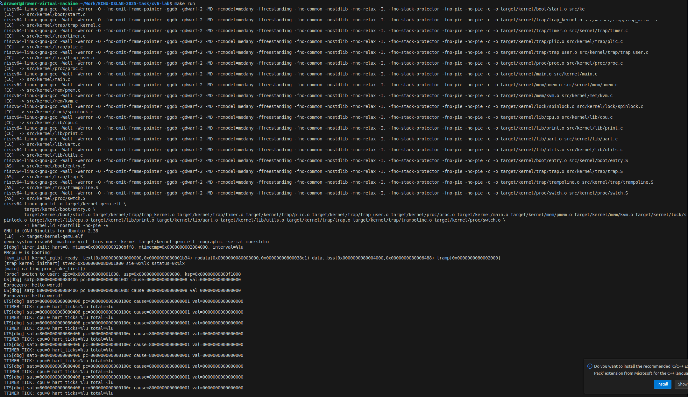

# LAB-4：第一个用户进程的诞生

> 实验四：Trap 与中断机制   
> 时间：2025 年 10 月

---

## 一、过程性日志（按测试阶段记录）

### 🧪 测试一：系统调用（syscall）

**目标：** 用户程序能通过 `ecall` 发出系统调用，内核正确识别并响应。  

**实现与调试过程：**

1. **编写 syscall 基础设施**  
   - 在 `user/sys.h` 和 `user/syscall_num.h` 定义 `SYS_helloworld`；
   - 在 `initcode.c` 中两次调用 `syscall(SYS_helloworld)`；
   - 在 `trap_user_handler()` 中检测 `scause == 8`（U 模式 ecall），进入 syscall 分支。

2. **实现内核响应逻辑**  
   - 读取 `tf->a7` 判断系统调用号；
   - 若为 `SYS_helloworld`，调用 `printf("proczero: hello world!\n");`；
   - 修改 `sepc = sepc + 4` 跳过 ecall 指令。

3. **结果验证**  
   - QEMU 启动后输出：
     ```
     Eproczero: hello world!
     Eproczero: hello world!
     ```
   - 表示用户态两次发出的 ecall 被成功捕获与处理。  
   ✅ **测试一通过**

---

### 🧪 测试二：用户态的时钟中断和串口中断

**目标：** 验证用户态程序运行时，定时器中断能打断执行并交回内核，再返回用户态继续运行。

**实现与调试过程：**

1. **硬件定时器配置（M-mode）**  
   - 在 `timer.c` 中设置 `mtime`、`mtimecmp`；
   - M 模式 `timer_vector` 每次中断后：
     ```c
     *(uint64*)CLINT_MTIMECMP(hart) = now + INTERVAL;
     w_sip(r_sip() | 2); // 置 SSIP
     ```
     这样 M-mode 将时钟事件转发为 S-mode 软件中断。

2. **S-mode Trap 初始化**  
   - 在 `trap_kernel_inithart()` 中开启：
     ```c
     sie |= (1 << 1) | (1 << 5); // SSIE + STIE
     sstatus |= SSTATUS_SIE;
     ```
   - 设置 `stvec = kernel_vector`，保证 S 态 trap 能捕获时钟中断。

3. **用户态 Trap 路径搭建**  
   - `user_vector` 保存寄存器并切换到内核页表；
   - `trap_user_handler()` 识别中断类型；
   - 若 `scause == 1` 或 `5`（软件/时钟中断），调用 `timer_interrupt_handler()`；
   - handler 中打印：
     ```c
     printf("TIMER TICK: cpu=%d hart_ticks=%lu total=%lu\n", ...);
     ```

4. **返回用户态**  
   - 调整 `return_to_user()`，在回用户前设置：
     ```c
     sstatus &= ~SSTATUS_SIE; // 防止重入中断风暴
     sstatus |= SSTATUS_SPIE; // sret 后自动开中断
     ```
     避免重复 trap。

5. **结果验证**  
   实际输出片段：
   ```
   U
   S[dbg] ... cause=8000000000000001 ...
   TIMER TICK: cpu=0 hart_ticks=xxx total=xxx
   U
   S[dbg] ... cause=8000000000000001 ...
   TIMER TICK: ...
   ```
   用户态被周期性中断 → 进入内核 → 计时 → 再返回用户态。  
   ✅ **测试二通过**

---

## 二、相较 Lab-3 的新增功能

| 模块 | 新增内容 | 说明 |
|------|-----------|------|
| 进程模块 | 引入 `proc_t` 结构、trapframe/context 支持 | 从“只有内核” → “第一个用户进程” |
| Trap 模块 | 用户态 trap 与 syscall 机制 | 支持用户发出系统调用并返回 |
| Timer 模块 | 时钟中断由 M 态转发给 S 态 | 验证用户态可被中断 |
| PLIC 模块 | 外部中断框架搭建（UART） | 尽管实验中暂未完全启用，但框架已具备 |
| 页表映射 | 新增 trampoline、KSTACK 映射 | 为 U-S 特权级切换铺路 |

> 🧩 Lab-3 解决“异常”（ecall），Lab-4 解决“异步中断”。  
> 从单步交互 → 到可被异步打断，系统正式具备“活性”。

---

## 三、实验理解与整体逻辑关系

整个实验可以看作“用户态 ↔ 内核态 ↔ M 模式”三层的控制权转移链路：

```text
U-mode  (initcode)
│  ecall / interrupt
▼
user_vector (trampoline.S)
│  保存通用寄存器
│  切换内核页表
▼
trap_user_handler (S-mode)
│  判断 scause:
│    8 → syscall
│    1/5 → timer
│    9 → external
│  调用对应 handler
▼
return_to_user
│  准备寄存器 + sret
▼
user_return (trampoline.S)
│  切换回用户页表
│  恢复通用寄存器
▼
U-mode 继续执行
```

M-mode 在后台驱动硬件时钟：
```text
M-mode timer interrupt
 └──> 更新 mtimecmp
 └──> 置 sip.SSIP = 1
S-mode 捕获 SSIP → timer_interrupt_handler()
```

这一闭环实现了：
> “用户态可被中断 → 内核态处理中断 → 再安全返回用户态”。

---

## 四、复杂逻辑图示：`return_to_user()` 的中断管理

```text
┌──────────────────────────────────┐
│  return_to_user(proc_t *p)       │
│----------------------------------│
│ w_stvec(user_vector)             │
│ w_sscratch(p->tf)                │
│ sie = STIE | SSIE                │
│ sstatus:                         │
│   SPP=0  → sret 去 U 模式        │
│   SPIE=1 → sret 后开中断         │
│   SIE=0  → 当前禁中断            │
│ 调 user_return(tf, satp)         │
│----------------------------------│
│    trampoline.S: 切换页表        │
│    sret → 回 U 模式              │
└──────────────────────────────────┘
```

若此时误开 `SIE=1`，则会在“尚未 sret 完成”时被再次中断，  
导致 `sepc/stvec/satp` 状态错乱 → page fault。  
因此这一行的设计是整个实验能稳定运行的关键。

---

## 五、实验带给我的思考

1. **从同步到异步：**  
   Lab-3 的 trap 是同步触发（用户主动 ecall），  
   Lab-4 的中断是异步触发（硬件定时器主动打断）。  
   这让我第一次真正感受到“操作系统的主动性”。

2. **多级特权协作：**  
   M-S-U 三个特权级层层衔接，每一层都要正确保存/恢复寄存器与页表。  
   任何一个寄存器（尤其是 `stvec` / `sstatus`）配置错误，都会直接崩溃。

3. **时钟是内核的心跳：**  
   它不仅驱动计时，更是调度、sleep/wakeup、抢占的基础。  
   能看到周期性的 `TIMER TICK`，就意味着系统开始“呼吸”了。

4. **调试的艺术：**  
   从最初的“只输出 RU”到后来的“中断风暴”，再到现在的稳定节拍，  
   每次修正都让我更深入地理解 RISC-V 的中断模型。

---

## 六、测试结果截图



---

## 七、结语

本实验从“只有内核的世界”跨越到“第一个用户进程的诞生”。  
我们不仅让用户态能发出请求（syscall），还能被外部事件打断（interrupt），  
操作系统从此具备了“管理时间”与“响应事件”的能力。  

> **从此，内核不再只是被动运行的程序，而是一个会呼吸的系统。**

---


