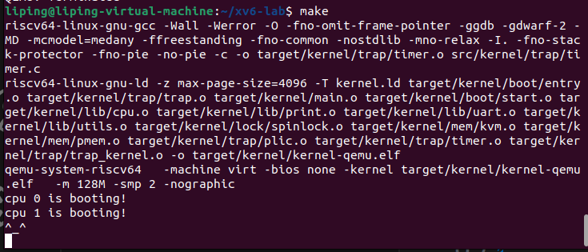
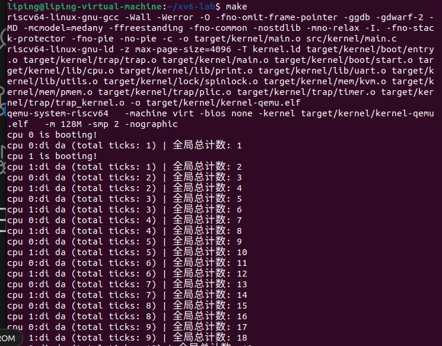

# LAB-3: 中断异常初步

## 1. 特权级切换与中断委托基础(start.c)

中断与异常是操作系统响应外部事件和处理运行时错误的核心机制。本次实验的核心是构建从M-mode到S-mode的中断处理通路，使内核能在S-mode下响应外设事件、维护系统时钟并处理异常。

- **M-mode到S-mode的切换逻辑**：  
  RISC-V没有直接的特权级降级指令，需借助陷阱返回机制。通过修改`mstatus`寄存器的`MPP`（上一特权级）字段为S-mode，将`mepc`（陷阱返回地址）设置为`main`函数入口，最后执行`mret`指令，使CPU从M-mode跳转至S-mode并开始执行`main`。

- **中断与异常委托配置**：  
  M-mode需通过寄存器将处理权下放给S-mode：  
  - `medeleg`：配置异常委托，将所有16类异常委托给S-mode处理；  
  - `mideleg`：配置中断委托，将S-mode相关的软件中断（bit1）、时钟中断（bit5）、外部中断（bit9）委托给S-mode，使S-mode能直接响应这些事件。

## 2. UART中断与输入处理(uart.c)

UART作为核心外设，需支持中断驱动的输入输出，并实现基本交互功能（换行、退格）。

- **输入功能完善**：  
  - 在`uart_getc()`中，将回车符`\r`转换为换行符`\n`，统一输出格式；  
  - 对退格符（`\b`或127）进行特殊处理，在`uart_intr()`中通过输出`\b \b`序列实现字符删除（回退光标→空格覆盖→再次回退）。

- **UART中断处理流程**：  
  1. **PLIC初始化**：`plic_init()`设置外设中断优先级，`plic_inithart()`将中断路由至当前CPU；  
  2. **中断识别**：在`external_interrupt_handler()`中，通过`plic_claim()`获取中断源ID，判断是否为UART中断；  
  3. **中断处理与确认**：若为UART中断，调用`uart_intr()`处理输入，完成后通过`plic_complete()`告知PLIC中断已处理。

## 3. 时钟中断处理(timer.c)

时钟中断是系统计时的基础，需跨M-mode和S-mode协作，确保定时触发与计数准确。

- **M-mode时钟初始化**：  
  `timer_init()`完成核心配置：  
  - 设置`MTIMECMP`（时钟比较寄存器）初始值为当前时间+固定间隔（`INTERVAL`）；  
  - 初始化`mscratch`存储时钟参数（`MTIMECMP`地址、间隔值），供中断处理使用；  
  - 配置`mtvec`为M-mode时钟中断入口（`timer_vector`），启用M-mode时钟中断（`MTIE`）。

- **跨模式中断传递**：  
  当`MTIME`（当前时间）达到`MTIMECMP`时，触发M-mode中断：  
  1. M-mode更新`MTIMECMP`以设置下一次中断；  
  2. 通过设置`SSIP`标志（S-mode软件中断 pending）将事件传递给S-mode。

- **S-mode计数管理**：  
  - `timer_update()`：更新计数时，通过自旋锁保护多核共享的总计数器（`sys_total_timer`），同时维护每个CPU的本地计数器（`sys_timer`），避免并发冲突；  
  - `timer_get_ticks()`：提供线程安全的总计数查询接口，通过加锁确保读取准确性；  
  - `timer_interrupt_handler()`：响应S-mode软件中断，更新计数后清除`SSIP`标志，宣告处理完成。

## 4. 异常处理(trap_kernel.c)

异常处理用于捕获并报告程序错误（如非法指令、内存访问错误），增强系统稳定性。

- **异常识别与处理**：  
  在`trap_kernel_handler()`中：  
  1. 通过`scause`寄存器判断异常类型（如“非法指令”“内存访问错误”）；  
  2. 结合`exception_info`数组输出具体异常信息，打印异常发生的地址（`sepc`）和相关值（`stval`），辅助调试；  
  3. 对未处理的异常，通过`panic`终止程序，防止错误扩散。

- **上下文保护**：  
  陷阱发生时，通过`kernel_vector`（汇编实现）保存32个通用寄存器状态；处理完成后恢复寄存器，确保程序执行流的连续性。中断使能通过`sstatus`（总开关`SIE`）和`sie`（分开关，如`STIE`/`SEIE`）实现精细控制。