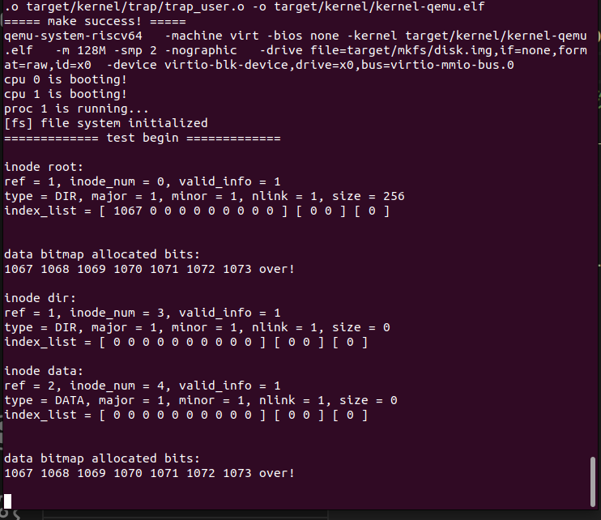
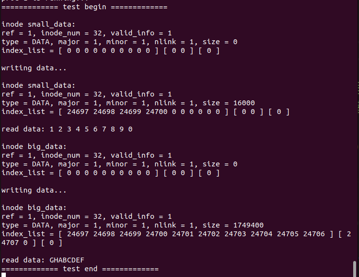
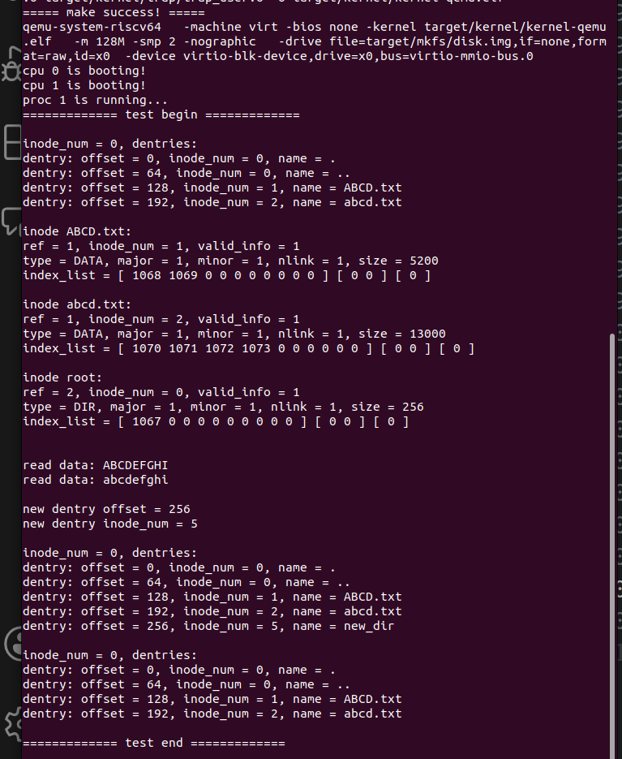
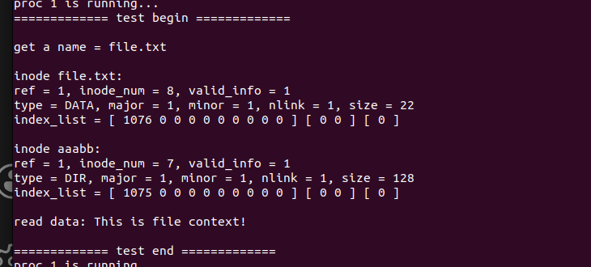

---

# LAB-8 文件系统实验报告（数据组织与层次结构）

## 一、实验目的

在 Lab-7 已实现 block-level 磁盘管理的基础上，本实验旨在：

1. 理解文件系统中 **inode 的结构与数据组织**
2. 实现 **层次化目录结构（dentry）**
3. 掌握 **路径解析与文件访问**
4. 为后续实验（LAB-9 文件抽象与进程文件管理）打基础

---

## 二、实验原理与设计

### 1. inode：文件数据组织

* **逻辑**：每个文件由若干个 block 构成

* **index 字段设计**：

  * `0 ~ INODE_INDEX_1-1`：直接映射（小文件）
  * `INODE_INDEX_1 ~ INODE_INDEX_2-1`：一级间接映射（中型文件）
  * `INODE_INDEX_2 ~ INODE_INDEX_3-1`：二级间接映射（大型文件）

* **size 字段**：

  * 数据文件：已使用逻辑空间 `[0, size)`
  * 目录文件：有效数据长度

* **内存 inode (`inode_t`) 与磁盘 inode (`inode_disk_t`)**：

  | 字段         | 描述             |
  | ---------- | -------------- |
  | ref        | 引用计数           |
  | valid_info | 内存有效标记         |
  | slk        | 睡眠锁            |
  | 其他         | 磁盘 inode 持久化信息 |

* **核心函数**：

  * `inode_rw`：磁盘 <-> 内存同步
  * `inode_get` / `inode_dup` / `inode_put`：生命周期管理
  * `inode_create` / `inode_delete`：创建与删除
  * `inode_read_data` / `inode_write_data`：数据读写

---

### 2. dentry：目录项管理

```c
typedef struct dentry {
    char name[MAXLEN_FILENAME];
    unsigned int inode_num;
} dentry_t;
```

* 根目录包含 `BLOCKSIZE / sizeof(dentry_t)` 个槽位
* 核心操作：

  * `dentry_search`：查找
  * `dentry_create`：创建
  * `dentry_delete`：删除

---

### 3. 路径解析

* 支持绝对路径：`/AAA/BBB/file.txt`
* 核心流程：

  1. 从 `ROOT_INODE` 开始
  2. 按层级查找 dentry，逐步获取 inode
  3. `get_element` 用于逐级解析路径

---

## 三、实验过程与结果

### 1. inode 生命周期测试

**操作**：

* 创建 inode（目录 / 文件）
* 检查 bitmap 分配
* 删除 inode，检查回收

**结果**：

* 分配、引用计数、删除逻辑正确
* 数据块与 inode bitmap 与预期一致



---

### 2. inode 数据读写测试

**操作**：

* 小文件写入：10 个整数
* 大文件写入：多页数据

**结果**：

* 数据写入、读取正确
* 多级间接映射生效


---

### 3. dentry 操作测试

**操作**：

* 查找目录项 `ABCD.txt` / `abcd.txt`
* 创建新目录项 `new_dir` 并删除

**结果**：

* dentry 增删查正确
* 根目录槽位更新正确



---

### 4. 路径解析测试

**操作**：

* 创建多级目录 `/AABBC/aaabb/file.txt`
* 写入文件内容
* 使用绝对路径解析 inode

**结果**：

* 路径解析函数 `path_to_inode` 与 `path_to_parent_inode` 正确
* 数据读取正确



---

## 四、实验总结

1. **inode**：实现大文件数据块管理
2. **dentry**：实现文件名到 inode 的映射
3. **路径解析**：实现层次化目录访问
4. 本实验为 **文件抽象、设备文件和进程文件管理（LAB-9）** 打下基础

---

